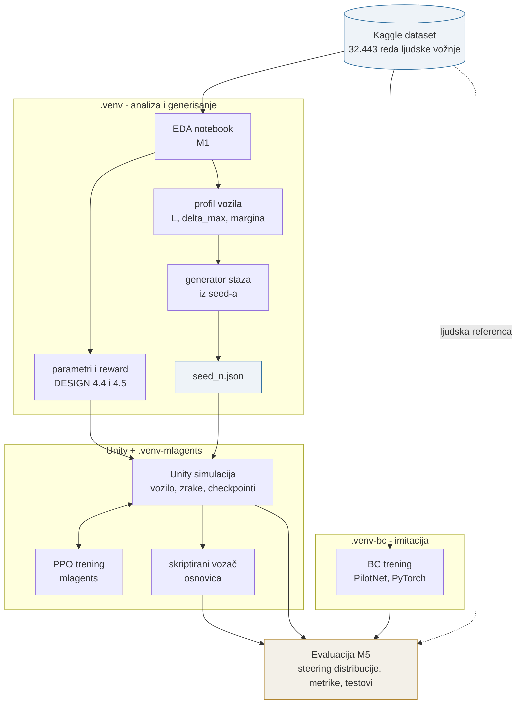

# Simulacija autonomnog vozila (Unity ML-Agents)

**Tema 28 - II parcijalni ispit** · Računarsko modeliranje i simulacija (II ciklus)


Simulacija autonomne vožnje u kojoj se porede dva pristupa učenju upravljanja vozilom:

1. **Reinforcement Learning (PPO)** - agent u Unity simulaciji uči voziti kroz
   pokušaje i grešku, na osnovu raycast senzora i nagrada za napredak po stazi.
2. **Behavioral Cloning (BC)** - konvolucijska mreža (PilotNet) trenirana
   supervizirano na podacima ljudske vožnje
   ([Self-Driving Car Simulator](https://www.kaggle.com/datasets/zaynena/selfdriving-car-simulator):
   slike kamere + steering uglovi, Udacity simulator format, dvije staze).
   *Dataset iz originalne postavke zadatka je uklonjen sa Kagglea; profesor je odobrio
   ovu zamjenu - detalji u [DESIGN.md](DESIGN.md).*

Poenta poređenja: RL uči **zadatak** (proći stazu bez sudara), BC uči **stil**
(imitira čovjeka). Evaluacija poredi distribucije steering odluka RL agenta, BC
modela i ljudske vožnje iz dataseta - koliko se naučena politika približi
prirodnoj vožnji. Dataset dodatno služi za kalibraciju simulacije (rasponi
akcija, reward za glatkoću) - detalji u [DESIGN.md](DESIGN.md).

## Generisanje staza iz seed-a

Staze se ne crtaju ručno nego se generišu iz **jednog cijelog broja**. Isti seed uvijek
daje isti fajl, bajt po bajt, i u istom procesu i u novom, pa se generisana staza može
pregledati u `git diff` kao i svaki drugi izvorni fajl.

Oblik krive je polarna harmonijska petlja:

$$
r(\theta) = R_0 \left(1 + \sum_k a_k \sin(k\theta + \phi_k)\right),
\qquad
a_k = \frac{A}{k^2}.
$$

$R_0 = 30$ m, $k \in \{2, 3, 4, 5\}$, $A \in [0.70, 0.90]$, a faze $\phi_k$ dolaze iz seed-a.
Pad amplitude po $1/k^2$ je ono što sprječava da visoki harmonici preuzmu oblik.

Dvije osobine ovog oblika rade stvarni posao. **Zatvara se po konstrukciji**, jer je svaki
harmonik cijeli umnožak od $\theta$, pa se krajevi nikad ne "šiju" naknadno; šav bi bio prekid
u zakrivljenosti koji vozilo osjeti. I **zakrivljenost mu je poznata u zatvorenoj formi**, jer su
$r$, $r'$ i $r''$ opet sume sinusa:

$$
\kappa(\theta) = \frac{r^2 + 2r'^2 - r\,r''}{\left(r^2 + r'^2\right)^{3/2}},
\qquad
R(\theta) = \frac{1}{|\kappa(\theta)|}.
$$

Odluka o prihvatanju staze se zato donosi analitički, a ne numeričkom derivacijom tamo gdje je
ona najmanje tačna.

**Veza s datasetom nije dekorativna.** Svaka staza se provjerava protiv profila vozila koji
je izveden iz M1 mjerenja, i nosi taj profil sa sobom. Prag najoštrije krivine nije odabran nego
izveden iz bicikl-modela, pri malim brzinama i punom zaokretu:

$$
R_{\min} = \frac{L}{\tan \delta_{\max}} = \frac{2.5}{\tan 25^\circ} = 5.36\ \text{m},
\qquad
r_{\text{floor}} = m \cdot R_{\min} = 1.3 \cdot 5.36 = 6.97\ \text{m}.
$$

Isti model, obrnut, daje koliko volana staza **traži** u svakoj tački, normalizovano na $[0, 1]$:

$$
s_{\text{req}}(\theta) = \frac{\arctan\!\big(L / R(\theta)\big)}{\delta_{\max}}.
$$

Na samom pragu to ispada

$$
s_{\text{req}}^{\max} = \frac{\arctan\!\big(\tan \delta_{\max} / m\big)}{\delta_{\max}} = 0.7893,
$$

**nezavisno od $L$**: međuosovinsko rastojanje se skrati između arkustangensa i poluprečnika, pa
je margina $m$ jedini parametar koji pomjera ovaj broj. Zato je margina poštena ručka, a ne jedna
od dvije koje se međusobno miješaju.

| Provjera | Šta znači |
|---|---|
| Najoštrija krivina | Ne smije ispod `r_floor` 6.97 m, izvedenog iz međuosovinskog rastojanja i maksimalnog zaokreta |
| Samopresijecanje | Zatvorena petlja koja se ne siječe |
| Minimalno razdvajanje | Dva dijela kruga ne smiju proći bliže od 12 m jedan drugom |
| Zahtjev za volanom | Nijedna staza ne smije tražiti **više** volana nego što je čovjek u datasetu ikad dao |

Zadnja stavka je kriterij SC-010. Mjeri se nad **skupom** prihvaćenih staza, ne po jednoj:
dvadeset staza koje svaka promaši na svoju stranu daju dobar prosjek, a dvadeset koje
promaše isto ne daju, i samo skupna brojka razlikuje ta dva slučaja.

Odbijeni seed se **čuva sa razlogom**, nikad se ne pokušava ponovo s podešenim parametrima.
Generator koji tiho uzorkuje dok ne uspije ima stopu prihvatanja koju niko ne vidi, a ta
stopa je nalaz o odnosu između minimalnog poluprečnika i statističkog cilja.

```powershell
# Jedna staza
python -m python.track.export --seed 7

# Oba skupa (train i eval), plus split fajl i izvještaj o seriji
python -m python.track.export --batch all

# Slike: staza sa označenom najoštrijom krivinom, i poređenje sa ljudskim volanom
python -m python.track.plots --seed 7 --match
```

Trenutno stanje: **34 od 40** train seed-ova prihvaćeno (85 posto), svih 10 eval seed-ova
prihvaćeno, skupni zahtjev za volanom unutar ljudskog. Detalji u
`results/tracks/batch_report.md`.

Unity čita gotov fajl i postavlja objekte. **U Unityju nema nijedne statistike**: sve što je
trebalo dokazati dokazano je u Pythonu i zapisano u `seed_<n>.json`, a učitavač odbija fajl
koji ne razumije umjesto da pročita polja koja slučajno prepoznaje.

## Skriptirani vozač: dva regulatora, jedna razlika

Skriptirani vozač gleda **samo** normalizovane udaljenosti zraka $d_i \in [0, 1]$ i njihove uglove
$\alpha_i$. Ne vidi stazu, ni markere, ni centralnu liniju. Oba regulatora vraćaju komandu volana
$s \in [-1, 1]$, a razlikuju se u jednoj stvari: kako od $d_i$ dolaze do ugla.

**MostOpen**, naivni: skreni prema jednoj najotvorenijoj zraci.

$$
i^\star = \arg\max_i d_i,
\qquad
s = \mathrm{clamp}\!\left(\frac{\alpha_{i^\star}}{\delta_{\max}},\, -1,\, 1\right).
$$

Kod izjednačenja pobjeđuje zraka bliža pravo naprijed, $\min |\alpha_i|$, a ne prva po redoslijedu
u nizu. To nije sitnica: otvorena ravnica vraća $d_i = 1$ za svaku zraku, i uzimanje prvog indeksa
bi svaki put skrenulo tvrdo lijevo.

**Zašto ovaj regulator mora da tresne.** Komanda može biti samo ugao na koji neka zraka već
pokazuje. Pri 13 zraka preko 180 stepeni to su umnošci od 15 stepeni naspram granice volana od
25 stepeni, pa su dostižne komande $0$, $\pm 0.6$ i $\pm 1.0$ nakon odsjecanja. Tri magnitude,
ništa između, dakle sredina krivine se ne može držati nego se mora alternirati. Predviđeno prije
nego što je ijednom pokrenuto (research R2), i izmjereno: **0 od 102** kruga.

**WeightedAverage**, usvojeni: svaka zraka glasa za svoj ugao, težina joj je koliko daleko vidi.

$$
w_i = \mathrm{clamp}_{[0,1]}(d_i),
\qquad
s = \mathrm{clamp}\!\left(\frac{1}{\delta_{\max}} \cdot
\frac{\sum_i w_i\, \alpha_i}{\sum_i w_i},\, -1,\, 1\right),
$$

uz $s = 0$ kada je $\sum_i w_i \le 10^{-6}$, jer tada nema otvorenog smjera za usrednjavanje i
bolje je držati kurs nego izmisliti skretanje iz dijeljenja nulom.

Ništa se ne lijepi za zraku, pa je skup dostižnih komandi neprekidan i kvantizacija koja tjera
`MostOpen` da tresne nestaje **po konstrukciji**, a ne naknadnim izglađivanjem. Simetrično očitanje
vraća tačno $0$ bez posebnog slučaja, jer se težine ogledaju a uglovi ponište.

Brzina se ne bira nego izvodi, iz dvije relacije koje nisu podešene:

$$
v_{\text{prianjanje}} = \sqrt{a\,R},
\qquad
v_{\text{kočenje}} = \sqrt{2\,a\,d_{\text{clearance}}}.
$$

Prva je granica bočnog ubrzanja u krivini poluprečnika $R$, druga standardna relacija zaustavnog
puta. Pri $a \approx 5.85$ m/s$^2$ prelomna tačka je **17.1 m**: ispod tog poluprečnika puni gas
traži više bočnog ubrzanja nego što gume mogu dati.

## Evaluacija: čime se poređenje mjeri

Poređenje se izvodi statistički, ne "na oko" (DESIGN §7.1). Primarna osa je glatkoća, mjerena
dvouzoračnim Kolmogorov-Smirnov testom, gdje je statistika $D$ **ujedno i veličina efekta**:

$$
D = \sup_x \left| F_{\text{model}}(x) - F_{\text{čovjek}}(x) \right|.
$$

Sekundarna osa je nivo volana na rešetci od 41 tačke, korakom 0.05, preko KL divergencije i
$\chi^2$ testa homogenosti:

$$
D_{\mathrm{KL}}(P \,\|\, Q) = \sum_{\ell} P(\ell) \log \frac{P(\ell)}{Q(\ell)},
\qquad
\chi^2 = \sum_{\ell} \frac{(O_\ell - E_\ell)^2}{E_\ell}.
$$

Svakoj kanti se dodaje $\varepsilon = 10^{-9}$ prije normalizacije, jer je KL beskonačan tamo gdje
referenca ima nultu masu, a takvih nivoa ima.

Stope završenih krugova se **nikad ne navode bez intervala**. Normalna aproksimacija na $\hat p = 1$
daje interval širine nula, pa se koristi Wilsonov:

$$
\frac{\hat p + \dfrac{z^2}{2n} \;\pm\; z \sqrt{\dfrac{\hat p(1-\hat p)}{n} + \dfrac{z^2}{4n^2}}}
{1 + \dfrac{z^2}{n}}.
$$

Zato 10 od 10 čita $[0.72, 1.00]$, a 33 od 33 čita $[0.90, 1.00]$: oba su 100 posto, i nisu isti
rezultat.

## Kako radi



Dataset ulazi na **dva mjesta i to nije slučajno**: iz njega se izvode parametri simulacije, a
istovremeno je ljudska referenca protiv koje se na kraju sve poredi. Zato isprekidana strelica ide
pravo do evaluacije.

Četiri vozača stižu do evaluacije: **PPO politika**, **BC model**, **skriptirani vozač** i
**čovjek iz dataseta**. Tri od njih voze ovu stazu; BC predviđa volan za kadrove koje je čovjek već
provozao, i ta razlika je u M5 izvještaju označena, a ne zamagljena.

## Notebooks

Dva notebooka, oba u Bosanskom i oba **korak po korak**, sa objašnjenjem uz svaku ćeliju: *šta*
radimo i *zašto*. Oba su izvršena i **izlazi su commitovani**, pa se mogu čitati na GitHubu bez
pokretanja ijedne ćelije.

### [`01_dataset_analysis.ipynb`](python/notebooks/01_dataset_analysis.ipynb) - analiza dataseta (M1)

83 ćelije, 32 sa kodom, 8 grafova. Odgovara na pitanje **odakle brojevi kojima je kalibrisana
simulacija**.

| Sekcija | Sadržaj |
|---|---|
| 0 | Šta je ovaj dataset i odakle je |
| 1 | Format i identitet kolona (`driving_log.csv` je bez headera, pa se dokazuje koja je koja) |
| 2 | Deskriptivna statistika: sredina, disperzija, min/max, histogrami |
| 3 | Prilagođavanje raspodjele i **χ² test saglasnosti** |
| 4 | Kalibracija konkretnih brojeva za Unity (DESIGN §4.4 i §4.5) |
| 5 | Autentičnost podataka: da li je dataset "friziran" |

### [`02_modeli_i_metode.ipynb`](python/notebooks/02_modeli_i_metode.ipynb) - modeli i metode

46 ćelija, 21 sa kodom, 10 grafova. Odgovara na pitanje **kako sve to radi**, sa formulama koje se
tu i pokreću.

| Sekcija | Sadržaj |
|---|---|
| 1 | Kako staza nastaje iz jednog cijelog broja, harmonik po harmonik |
| 2 | Odakle prag od 6.97 m, i zašto ne zavisi od međuosovinskog rastojanja |
| 3 | Dva regulatora skriptiranog vozača, i zašto naivni ne može proći krug |
| 4 | Šta PPO uči, i šta se stvarno vidi na krivama treninga |
| 5 | Kojim testovima se poredi: KS, KL, χ², Wilsonov interval |

**Ovaj notebook ništa ne reimplementira.** Poziva `python/track`, `python/eda` i `python/m5`, iste
module koje koristi i ostatak projekta, pa se grafovi ne mogu razići od koda koji stvarno generiše
staze. Zato u njemu i nema treninga: PPO traži Unity i traje satima, a ovdje se čitaju krive koje
su ti runovi već proizveli.

## Struktura repozitorija

| Putanja | Sadržaj |
|---------|---------|
| `unity/SelfDrivingSim/` | Unity projekat: scena sa stazom, vozilo, `CarAgent` |
| `config/ppo_car.yaml` | Hiperparametri PPO treninga |
| `python/track/` | Profil vozila, generator staza, provjere geometrije, izvoz |
| `python/notebooks/` | [01](python/notebooks/01_dataset_analysis.ipynb): analiza dataseta (M1). [02](python/notebooks/02_modeli_i_metode.ipynb): modeli i metode |
| `python/eda/` | Učitavanje dataseta i statistika (M1) |
| `python/bc/` | Behavioral cloning pipeline (PyTorch, M4) |
| `python/tests/` | Testovi za `eda`, `track` i `bc` |
| `requirements-bc.txt` | Pinovane verzije za `.venv-bc` (M4) |
| `specs/` | Specifikacije i plan po feature-ima (spec-kit) |
| `dataset/` | Kaggle dataset (nije u gitu - vidi Postavljanje) |
| `results/` | Trening logovi, grafovi, trenirani modeli |
| `results/EXPERIMENTS.md` | Jedan red po trening runu (RL i BC) |
| `DESIGN.md` | Arhitektura i sve dizajn odluke |
| `WORKFLOW.md` | Kako Unity radi + razvojni proces |
| `CONTRIBUTING.md` | Git konvencije (git flow, atomic commiti) |
| `ENVIRONMENT.md` | Provjereno stanje mašine i zamke pri instalaciji |

## Preduslovi

Tačne, provjerene verzije i zamke: `ENVIRONMENT.md`.

| Alat | Verzija | Napomena |
|------|---------|----------|
| Unity Hub + Unity Editor | 6000.5.3f1 | preko [Unity Hub](https://unity.com/download); `com.unity.ml-agents` 4.0.3 traži Unity 6000.0+ |
| Python | 3.10.11 | novije verzije nekompatibilne sa `mlagents` |
| Git + Git LFS | aktuelne | `git lfs install` jednom po mašini |
| NVIDIA GPU + CUDA drajveri | - | opciono, ubrzava BC trening |
| Kaggle nalog | - | za preuzimanje dataseta |

## Postavljanje

```powershell
# 1. Kloniranje repo-a
git clone https://github.com/SafetImamovic/RMS.git; cd RMS
git lfs install

# 2. Kreiranje Python okruženja - tri, namjerno odvojena (detalji: ENVIRONMENT.md)
#    .venv za M1 EDA, .venv-mlagents za RL, .venv-bc za BC trening.
#    Razlog: mlagents pinuje numpy==1.23.5, a BC traži noviji numpy uz torch 2.6.
py -3.10 -m venv .venv
.venv\Scripts\Activate.ps1
pip install -r python/requirements.txt

# 3. Preuzimanje dataseta → dataset/ (git-ignorisan; koristi se spojeni dataset/dataset/)
kaggle datasets download -d zaynena/selfdriving-car-simulator -p dataset --unzip
#   (ili ručno sa Kaggle stranice, uz raspakivanje u dataset/)

# 4. Kreiranje BC okruženja (M4) - odvojeno od .venv i .venv-mlagents
py -3.10 -m venv .venv-bc
.venv-bc\Scripts\Activate.ps1
pip install -r requirements-bc.txt
python -c "import torch; print(torch.cuda.is_available(), torch.cuda.get_device_name(0))"
#   Mora ispisati True i ime GPU-a. Trening odbija da krene bez GPU-a
#   osim uz izričit --allow-cpu, jer je CPU epoha višesatna.

# 5. Otvaranje Unity projekta
#    Unity Hub → Add → odabir unity/SelfDrivingSim → otvaranje
#    (prvi import traje nekoliko minuta - Unity gradi Library/ keš)
```

## Upotreba

Svaka grupa komandi traži svoje okruženje; aktiviranje ide prije pokretanja.

```powershell
# ---- M1: analiza dataseta (.venv) ----
.venv\Scripts\Activate.ps1
python -m python.eda.report          # sačuva results/plots + results/eda/m1_stats.json
jupyter notebook python/notebooks/01_dataset_analysis.ipynb   # M1: dataset, korak po korak
jupyter notebook python/notebooks/02_modeli_i_metode.ipynb    # generator, regulatori, PPO, testovi
pytest python/tests                  # 425 prolaza, 4 preskočena (bc moduli traže torch)
#   U ČISTOM KLONU: 321 prolaz, 92 preskočena, nula padova. Razlika je dataset i
#   sirovi tragovi: oba su git-ignorisana, pa testovi koji ih čitaju preskaču.
#   Preskakanje, ne pad - nedostajući opcioni ulaz nije pokvaren test (010/T034).
#   NE dodavati -q: pytest.ini već ima addopts = -q, pa drugi -q ugasi i broj prolaza.
#   Ne skraćivati izlaz sa | tail: -q ispisuje samo tačke dok ne dođe do sažetka,
#   pa odsječen izlaz izgleda kao manji ukupan broj (izmjereno u 005/T046).

# M2 - generisanje staza iz seed-ova (vidi sekciju gore)
python -m python.track.export --batch all

# ---- M3: RL trening (.venv-mlagents) ----
.venv-mlagents\Scripts\Activate.ps1

# 1. Trening. Pokrenuti IZ KORIJENA repozitorija, da trenerov results/ bude projektov results/.
#    Trener prvo osluskuje, pa se onda pritisne Play u Unity Editoru sa otvorenom
#    Assets/Scenes/Training.unity. Ako je otvorena neka druga scena, trener ceka i istekne.
mlagents-learn config/ppo_car.yaml --run-id=ppo_car_v01 --seed=1 --torch-device=cuda
#    Smanjeni budzet za spread i tjuning runove (2M umjesto 5M):
mlagents-learn config/ppo_car_spread.yaml --run-id=ppo_car_spread_a --seed=1 --torch-device=cuda

# 2. Zaustavljanje: JEDAN Ctrl+C i cekati red "Exported ... .onnx".
#    Drugi Ctrl+C preskace izvoz i noc treninga ostaje samo kao checkpoint fajl.

# 3. Kriva kao podatak: destilovani CSV po runu, to je ono sto se commituje.
python -m python.rl.export_curves results/ppo_car_spread_a

# 4. Evaluacija: Assets/Scenes/Evaluation.unity, pa Play. SweepRunner sam prolazi
#    10 izdvojenih seedova i pise redove u results/rl/ i trag po runu u results/drive_logs/.
#    Model i deterministicka inferenca se biraju na BehaviorParameters u toj sceni.

# 5. Izvjestaj za M5 (u .venv, ne u .venv-mlagents):
python -m python.rl.report results/rl/eval_ppo_car_spread_a_deterministic.csv `
    --traces results/rl/traces/deterministic --name spread_a_deterministic `
    --dataset dataset/dataset/dataset/driving_log.csv

tensorboard --logdir results

# ---- M4: BC trening (.venv-bc) ----
.venv-bc\Scripts\Activate.ps1
pytest python/tests                  # 480 prolaza (ništa se ne preskače, torch je tu)

# 1. Podjela train/val: blokovski holdout sa 8 s zaštitnim pojasom.
#    Piše results/bc/split.json. Deterministična - isti fajl bajt po bajt.
python -m python.bc.split

# 2. Dva runa koja se razlikuju u tačno jednoj stvari, politici balansiranja.
#    Oko 5-6 minuta po runu na RTX 3050. --policy i --run-id su obavezni.
python -m python.bc.train --policy none            --run-id bc_unbalanced_v01
python -m python.bc.train --policy downsample_zero --run-id bc_balanced_v01

# 3. Evaluacija po runu, pa poređenje para.
python -m python.bc.evaluate --run bc_unbalanced_v01
python -m python.bc.evaluate --run bc_balanced_v01
python -m python.bc.evaluate --compare bc_balanced_v01 bc_unbalanced_v01

# 4. Opciono: animacija predikcija preko kadrova koje je čovjek vozio (otvorena petlja).
python -m python.bc.playback --run bc_unbalanced_v01 bc_balanced_v01 --track track2data

# ---- Heuristički vozač: vožnja je u Unityju, izvještaj u .venv ----

# 1. Jedan run rukom. Unity → Assets/Scenes/HeuristicWeighted.unity → Play.
#    Panel gore lijevo: [G] sakriva/prikazuje, gornji toolbar bira regulator
#    (MostOpen / WeightedAverage), drugi bira način oblikovanja komande.
#    Promjena regulatora NAMJERNO restartuje run: run koji bi se prebacio na pola
#    opisao bi dva regulatora u jednom redu zapisa.
#    Svaki završen run dopisuje red u results\heuristic\runs_<vrijeme>.csv, a trag
#    po koraku u trace_<vrijeme>.csv. Oba su git-ignorisana; u repozitorij ulaze
#    samo izvještaji (results\heuristic\*.md).

# 2. Sweep preko svih 34 trening seeda, bez izlaska iz Play modea. U sceni: dodavanje
#    SweepRunner-a, povezivanje TrackBuilder / HeuristicDriver / StartPlacer /
#    CarController / CarAgent, pa u Inspectoru: seedSet = Train, timeScale = 2,
#    runOnStart = true, fans = arrangements koje se porede. Play.
#    timeScale 2 je najbrže na čemu se mjerenja reprodukuju; na 4 se mjeri frame
#    clock, a ne vožnja (research R4a). Jedna konfiguracija traje 6.3-7.6 minuta,
#    što NE staje u SC-004 budžet od pet minuta - zapisano kao promašaj, ne zaobiđeno.

# 3. Izvještaj nad zapisom runova (.venv).
.venv\Scripts\Activate.ps1
python -m python.heuristic.report              # najnoviji results\heuristic\runs_*.csv

#    --spread uzima prag šuma iz fajla sa ponovljenim runovima istog seeda; bez njega
#    nijedna razlika nije nalaz (FR-015). --traces dodaje raspodjelu volana (US4) i
#    poređenje sa naučenim vozačem iz results\bc\run_bc_balanced_v01.
python -m python.heuristic.report results\heuristic\runs_A.csv `
    --spread results\heuristic\runs_B.csv `
    --traces results\heuristic\us4
```

Svaki run piše `results/bc/run_<id>/` sa `checkpoint.pt`, `run_record.json` i
`distributions.json`, a poređenje para piše `results/bc/comparison.md`. Svaki trening run se
upisuje i u `results/EXPERIMENTS.md`, u istoj sesiji u kojoj je pokrenut.

Očekivane vrijednosti za gornji recept (izmjereno 2026-08-05, ista mašina): podjela daje 25.957
trening i 5.576 validacionih redova uz razmak 8.09 s; nebalansiran run daje validacionu MSE
**0.086670**, balansiran **0.090899**, oba naspram osnovice od oko 0.1536. Trening se reprodukuje
na **±0.0005** MSE, ne tačnije - GPU bira kernele nedeterministički (DESIGN §6.2, research R13).

Očekivane vrijednosti za heuristički recept (izmjereno 2026-08-16, 34 trening seeda, 13 zraka
preko 180 stepeni, timeScale 2): `WeightedAverage` završava **34 od 34** kruga, prosjek
**26.496 s**, nula dodira zida; `MostOpen` završava **0 od 34** i uvijek udari u zid za oko 2.7 s.
Ponovljivost istog seeda: **0.16 s** raspona po vremenu kruga i **0.0063** po `|dsteer|` P95 nad
pet runova. Izvještaj o raspodjeli volana i poređenje sa BC kolonom:
[results/heuristic/us4_steering.md](results/heuristic/us4_steering.md).

Poređenje za M5 (RL / BC / heuristika / čovjek) radi iz čistog klona, bez dataseta i bez
sirovih tragova. Ulazi su commitovani u `results/comparison/`, po jedan mali CSV po vozaču:

```powershell
.venv\Scripts\Activate.ps1

# 1. Tabela i oba poređenja (primarna osa |Δsteering|, sekundarna nivo volana).
#    Piše results\comparison\m5_comparison.md i steering_histogram.csv.
python -m python.m5.compare

# 2. Tri figure iz istih ulaza. Nijedna se ne snima rukom (SC-005).
python -m python.m5.plots

# 3. Regenerisanje samih ulaza. Ovo je JEDINI korak koji traži sirove tragove i
#    dataset, i pokreće se samo kad se sweep ponovo odvozi.
python -m python.rl.comparison_inputs
#    BC kolona ide kroz .venv-bc, jer .venv nema torch:
.venv-bc\Scripts\Activate.ps1
python -m python.bc.export_predictions --run-id bc_balanced_v01
```

Očekivane vrijednosti za gornji recept: RL 009 deterministički **10 od 10** runova (po tri
kruga) uz **20.808 s po krugu** i nula dodira zida, heuristika **34 od 34** jednokružna runa uz
**23.655 s po krugu**. Runovi nisu iste dužine, pa je uporediva veličina sekunda po krugu, a ne
vrijeme runa. Na primarnoj osi
posle kvantizacije na ljudsku rešetku RL deterministički je najbliži čovjeku sa **D = 0.2682**.
Puni izvještaj: [results/comparison/m5_comparison.md](results/comparison/m5_comparison.md).

**Dvije stvari koje recept traži, a nisu u repozitoriju.** Dataset (`dataset/`) i sirovi
tragovi (`results/drive_logs/`, `results/heuristic/**/trace_*.csv`) su git-ignorisani namjerno.
Zato korak 3 postoji odvojeno od koraka 1 i 2: ko samo čita rezultate, ne treba mu ništa osim
klona i `.venv`.

Detaljan razvojni proces (Play mode, heuristička vožnja, testiranje): [WORKFLOW.md](WORKFLOW.md).

## Status

**Svih pet milestone-a je zatvoreno** (M1 do M5, plan u [DESIGN.md](DESIGN.md) §9). Ostaje pisanje
rada i odbrana, ne kod. Verdikt po milestone-u je u DESIGN.md: M3 u §5.2, M5 u §7.2.

- [x] M1 - analiza dataseta, kalibracija parametara (`results/eda/m1_report.md`)
- [x] M2 - Unity okruženje (staza, vozilo, agent, heuristička vožnja)
- [x] M3 - PPO trening. **ISPUNJEN 2026-09-01**, na četvrti pokušaj i preko tri seeda:
      30/30 izdvojenih runova, tri kruga bez dodira zida (DESIGN §5.2)
- [x] M4 - BC trening, dva runa koja se razlikuju u jednoj stvari (`results/bc/comparison.md`)
- [x] M5 - evaluacija i poređenje (`results/comparison/m5_comparison.md`)

**Generalizacija je izmjerena 2026-09-02** (feature 011): ista politika, bez dotreniravanja, na
**33 nove staze** koje niko nije gledao daje **33 od 33** kruga i nula dodira zida, uz Wilsonov
interval [89.6, 100.0]. Detalji: [results/rl/generalisation.md](results/rl/generalisation.md).

**Zapisano kao nedovršeno, ne kao neuspjeh.** Sonda od 5M koraka koja bi potpuno razdvojila
nagradu od istraživanja od senzorike nije vožena, pa je to razdvajanje djelimično. Stoji u
[results/EXPERIMENTS.md](results/EXPERIMENTS.md).

## Srodni projekti

Dva ranija projekta koja se dodiruju sa ovim, svaki sa jedne druge strane.

### [MultiAgentRobot](https://github.com/SafetImamovic/MultiAgentRobot)

Multi-agentski sistem autonomnih Roomba robota koji kooperativno čiste prostoriju, Python i Pygame,
politika trenirana **istim algoritmom, PPO**, od 5.000 do 1.000.000 koraka.

**Zajedničko je algoritam, razlika je broj agenata i to šta se nagrađuje.** Tamo više agenata dijeli
prostoriju i mjeri se pokrivenost i broj koraka po agentu; ovdje jedan agent vozi stazu i mjeri se
završen krug bez dodira zida. Ista klasa politike na dva zadatka koja se ne preklapaju.

### [SupplyCascade](https://github.com/SafetImamovic/SupplyCascade)

Kaskadni padovi u globalnom lancu snabdijevanja, projekat iz **istog predmeta**, rađen sa Ensarom
Serdarevićem. Lanac je usmjereni graf (`NetworkX`), a propagacija kvarova se prati discrete-event
simulacijom (`SimPy`) nad centralizovanom i decentralizovanom topologijom.

**To je druga vrsta simulacije, i po taksonomiji iz §7.1 se razlikuje u skoro svakoj stavci.**
SupplyCascade je discrete-event: vrijeme skače od događaja do događaja, stanje je diskretno
(paketi, čvorovi, kvarovi), a mjeri se otpornost mreže. Ovaj projekat je vremenski diskretan sa
fiksnim korakom od 0.02 s, stanje mu je kontinualno (19 realnih brojeva iz senzora), a mjeri se
izvršenje jednog agenta. Oba su agentska i oba stohastička, i tu sličnost prestaje.

## Dataset

**[Self-Driving Car Simulator](https://www.kaggle.com/datasets/zaynena/selfdriving-car-simulator)**,
Kaggle, korisnik `zaynena`. Snimak ljudske vožnje u
[Udacity simulatoru](https://github.com/udacity/self-driving-car-sim): slike tri kamere plus
`driving_log.csv` bez headera, sedam kolona.

| Folder (raspakovano) | Redova | Sadržaj |
|---|---|---|
| `track1data/` | 10.615 | Staza 1, ravna i lakša petlja |
| `track2data/` | 21.828 | Staza 2, planinska sa oštrim krivinama |
| `dataset/` | **32.443** | Obje spojene, i to je referenca koja se koristi |

Koristi se **spojeni** `dataset/`, jer `python/bc/config.py` postavlja `DATASET_NAME = "combined"`
i svaka objavljena brojka u projektu je čitana protiv njega. Razlika nije kozmetička: udio vožnje
pravo je 58.6 posto na spojenom naspram 79.3 posto na track1, a poređenje varijanse sa RL politikom
se **obrne** ako se uzme samo jedna staza. Zabilježeno u `specs/010-m5-evaluation/research.md`, R5.

### Zašto ovaj, a ne onaj iz postavke

Dataset naveden u postavci zadatka (`kaggle.com/datasets/chethuhn/selfdriving-car`) je **uklonjen
sa Kagglea**, provjereno 2026-07-12, URL vraća 404. **Profesor je odobrio zamjenu 2026-07-23** za
`zaynena/selfdriving-car-simulator`, dataset istog domena i u istom Udacity formatu. Puni zapis je
u [DESIGN.md](DESIGN.md), u napomeni na vrhu.

### Šta je u repozitoriju, a šta nije

**Dataset se ne redistribuira ovdje.** `dataset/` je git-ignorisan i preuzima se sa Kagglea
komandom iz sekcije Postavljanje. Ono što jeste commitovano su **izvedeni ulazi za poređenje**
pod `results/comparison/`: kolone volana i brzine po vozaču, bez ijedne slike, ukupno oko 2 MB
naspram 6.2 MB samog `driving_log.csv` i znatno više za `IMG/`.

To nije samo ušteda prostora. Zbog toga cijelo M5 poređenje i sve tri figure **reprodukuju se iz
čistog klona bez dataseta i bez sirovih tragova**, što je provjereno pokretanjem, ne čitanjem.

## Licence

| Šta | Licenca |
|---|---|
| Ovaj repozitorij, kod i dokumentacija | [MIT](LICENSE) |
| Udacity simulator koji je proizveo snimke | MIT, [udacity/self-driving-car-sim](https://github.com/udacity/self-driving-car-sim) |
| Sam dataset na Kagglu | uslovi stoje na [stranici dataseta](https://www.kaggle.com/datasets/zaynena/selfdriving-car-simulator); dataset se ovdje ne redistribuira |
| Unity ML-Agents (`com.unity.ml-agents` 4.0.3) | Apache 2.0, Unity Technologies |
| Unity Inference Engine (`com.unity.ai.inference` 2.6.1) | Unity Terms of Service, [unity.com/legal](https://unity.com/legal) |
| PyTorch, NumPy, pandas, SciPy, matplotlib | BSD ili slično permisivno, vidi `requirements*.txt` |

Dataset se koristi u akademske svrhe, kao ulaz za analizu i trening, i nije uključen u ovaj
repozitorij.

